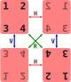
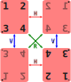
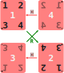
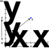
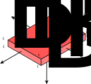

Having recently moved to a new country, one of the many tasks I've had to complete is the purchase of a mattress.
My purchase got me wondering how and when I should flip and rotate it to optimise it's longevity.

The answer lies in a branch of mathematics called [Group Theory](https://en.wikipedia.org/wiki/Group_theory).
As a side note, some of the earliest contributions to group theory were made by [Évariste Galois](https://en.wikipedia.org/wiki/%C3%89variste_Galois) - a French mathematician who died in a duel at age twenty.
Life was a little bit different in the 1800s...

## Flip and Rotate!

When it comes to flipping a mattress, the group in question is the set of physical transformations that can be applied to the mattress.
Practically, there are only four mattress positions that are relevant and three unique ways to move through those positions.
These four positions and the transitions between them are shown below.
In red, there is a horizontal flip H which flips the mattress over along its long axis.
In blue, the vertical flip V flips the mattress along its short axis.
The rotation R, shown in green, turns the mattress $\pi$ radians without flipping it over.
In the illustration below, greyed out numbers are on one side of the mattress, and black numbers on the other.

Because all transitions are a rotation through $\pi$ radians, the direction of rotation doesn't matter.
A clockwise rotation R has the same effect as its anti-clockwise counterpart.
Similarly, performing a horizontal flip by lifting corners[^lift-vs-rotate] 1 and 3 has the same effect as a horizontal flip by lifting corners 2 and 4.

It's also worth noting that combinations of transitions can have the same result.
For example, doing two R rotations is the same as doing nothing.
A vertical flip V followed by a horizontal flip H is the same as a rotation R.
A rotation R followed by a horizontal flip H is the same as a vertical flip V.
That last equivalence is an important one - it means that it's possible to transition through all four mattress positions without ever having to perform a vertical flip.
That's good news!
In the real world, vertical flips take much more effort to perform than rotations and horizontal flips.

All of this sounds a bit much for the simple task of flipping your mattress.
There's an easy trick to simplify everything.
Draw two dots on your mattress, one in the bottom left corner on the top side of the mattress, and one in the top left corner on the bottom side.
Once again, the convention of greying out elements on one side of the mattress is used.

By following the two rules below, the mattress will pass through all four positions sequentially.

1. When there is a dot on the bottom left of the mattress, do a rotation R.
2. When there is a dot on the top right of the mattress, do a horizontal flip H.

To trace the mattress movements better, let's get rid of the unused vertical flips, and track the traversal of mattress positions by labelling each position with a new number in the center of the mattress.

It's now easy to see that by following the two rules, the mattress will pass through every position.
Starting at position 1, there is a visible dot in the lower left corner.
According to rule one, we should do a rotation R to get to position 2.
This moves the dot to the top right on the top side of the mattress.
The next time we need to flip our mattress, rule two applies because the dot is the top right corner.
We flip the mattress over with a horizontal flip H, taking the mattress to position 3.
The dot in corner 1 that was on the bottom side moves to the top side and is mirrored to the bottom left.
Rule one therefore applies for the next transition, taking the mattress to position 4.
Finally, a dot in the top right means we should do a horizontal flip.
The mattress moves back back to position 1 and the cycle repeats.

## Formalising Transformations

All these transformations and rotations are a little tricky to keep track of.
We've only got four positions and three unique transitions to think about.
What if we need to consider arbitrary rotations, or translational movements?
What if the mattress isn't shaped liked a mattress (a [spherical cow](https://en.wikipedia.org/wiki/Spherical_cow) maybe?)?
What if the mattress exists in four physical dimensions?
Things can get out of hand pretty quickly.
To help us, we can use matrices from the field of [Linear Algebra](https://en.wikipedia.org/wiki/Linear_algebra).

First, let's start with something simple - a point P on a number line.
We'll name the point's position U.

P is entirely defined in one dimension by one number - its position on the number line.
How we can we represent P moving from position U (the red dot) to position V (the blue dot)?

We could multiply U by some factor T - like this: $T\times U = V$.
In our example, U is 1 and V is 8, making T 8 too.
When $T > 1$, a right shift along the number line is performed.
When $0 < T < 1$, a left shift is performed.
When $T < 0$, P is mirrored around 0.
A special case is $T = 1$.
This is the 'do nothing' case and is conventionally given the symbol $I$, where $I$ stands for _Identity_.

This is easily extended into higher dimensions.
Let's add another axis and try out some transformations!

$U$ and $V$ are now fully defined by two numbers - their position along the horizontal axis and their position along the vertical axis.
By convention, when dealing with abstract numbers, the horizontal axis is called the x-axis and the vertical axis is called the y-axis.

Since changing a point's position on the x-axis has no effect on it's position on the y-axis, and vice-versa, we can model the move from $U$ to $V$ by treating each axis separately.

For the movement in the x-axis:
$$
\color{white}

T_x U_x = V_x
$$
Similarly in the y-axis:
$$
\color{white}

T_y U_y = V_y
$$

With a few more dimensions to handle, this could get a bit tedious.
We can combine the equations into one by using matrix maths:

$$
\color{white}

\left[\begin{matrix}
  T_x & 0 \\
  0   & T_y
\end{matrix}\right]

\left[\begin{matrix}
  U_x \\
  U_y
\end{matrix}\right]

=

\left[\begin{matrix}
  T_x U_x \\
  T_y U_y
\end{matrix}\right]
$$

More generally:
$$
\color{white}

\left[\begin{matrix}
  a & b \\
  c & d
\end{matrix}\right]

\left[\begin{matrix}
  x \\
  y
\end{matrix}\right]

=

\left[\begin{matrix}
  ax + by \\
  cx + dy
\end{matrix}\right]
$$

Applying this equation to all points in a shape allows us to fully define all sorts of transformations - from translation, to rotation and shear, to mirroring along an arbitrary axis.
By changing $a$, $b$, $c$ and $d$, we get different kinds of transformations.

Let's formalise the mattress transformations.
To do this precisely, we need to start thinking about the mattress in three dimensions.
Let's add a z-axis, give the mattress some thickness and position its center at $(0,0,0)$.

Let's label the corners with a $C$ and subscript the label to specify whether the corner is on the top or bottom side of the mattress.
For example, $C_{T2}$ is corner 2 on the top side of the mattress.
$C_{B3}$ is corner 3 on the bottom side of the mattress.

Let's also give ourselves some numbers to work with for illustrative purposes.
$$
\color{white}

C_{T1} = ( 0.5, 1,  0.2) \\
C_{B1} = ( 0.5, 1, -0.2) \\

C_{T2} = (0.5, -1,  0.2) \\
C_{B2} = (0.5, -1, -0.2) \\

C_{T3} = (-0.5, -1,  0.2) \\
C_{B3} = (-0.5, -1, -0.2) \\

C_{T4} = (-0.5, 1,  0.2) \\
C_{B4} = (-0.5, 1, -0.2)
$$

Positioning the mattress at $(0,0,0)$ avoids having to translate the mattress to $(0,0,0)$ and then back before and after the rotation.
Translation in $N$ dimensions requires $N+1$ dimensions to describe.
The extra dimension is a projected plane (or hyperplane when $T > 2$) whose shearing transformation describes the translation in the lower dimensions(see [Matrix Translations](https://en.wikipedia.org/wiki/Translation_(geometry))).
Let's not go there for now...

Rotation transformations are expressible without the introduction of a higher dimension.
I found this [lovely post](https://austinmorlan.com/posts/rotation_matrices/) by Austin Morlan with a very clear derivation of rotation matrices for rotations around the x, y and z axes.

We'll start with the R transformation.
This is a rotation of $\pi$ radians around the z-axis.
The rotation matrix is:

$$
\color{white}

T_z=
\left[\begin{matrix}
  cos(\theta) & -sin(\theta) & 0 \\
  sin(\theta) &  cos(\theta) & 0 \\
  0           &  0           & 1
\end{matrix}\right]
$$

We want to rotate the mattress through $\pi$ radians, so $\theta = \pi$.
This makes the rotation matrix $T_z$ quite simple:

$$
\color{white}

T_z=
\left[\begin{matrix}
  -1 &  0 & 0 \\
   0 & -1 & 0 \\
   0 &  0 & 1 \\
\end{matrix}\right]
$$

To rotate the mattress, apply the rotation to every point that makes up the mattress.
For every point U in the mattress, move it to its new position V:
$$
\color{white}

T_z U = V
$$

Let's take a few sample points and check that our maths works out.
We'll use points at a non-zero z height to show that the rotation doesn't affect the mattress in the z direction.

First, let's examine $C_{T1}$.
Applying $T_z$:
$$
\color{white}

\left[\begin{matrix}
  -1 &  0 & 0 \\
   0 & -1 & 0 \\
   0 &  0 & 1 \\
\end{matrix}\right]

\left[\begin{matrix}
  0.5 \\
  1 \\
  0.2 \\
\end{matrix}\right]

=

\left[\begin{matrix}
  -1 \times 0.5 +  0\times 1 + 0\times 0.2 \\
   0 \times 0.5 + -1\times 1 + 0\times 0.2 \\
   0 \times 0.5 +  0\times 1 + 1\times 0.2 \\
\end{matrix}\right]

=

\left[\begin{matrix}
  -0.5  \\
  -1    \\
   0.2
\end{matrix}\right]
$$

We can play the same game with another point - say $C_{B3}$:
$$
\color{white}

\left[\begin{matrix}
  -1 &  0 & 0 \\
   0 & -1 & 0 \\
   0 &  0 & 1 \\
\end{matrix}\right]

\left[\begin{matrix}
  -0.5 \\
  -1 \\
  -0.2 \\
\end{matrix}\right]

=

\left[\begin{matrix}
  0.5  \\
  1    \\
 -0.2
\end{matrix}\right]
$$

Each time, the point gets rotated $\pi$ radians around the z-axis without changing its z position.

Vertical flips V and horizontal flips H are rotations through $\pi$ radians around the x and y axes respectively.
The rotation matrices are similar.

For a vertical flip V:
$$
\color{white}

T_x=
\left[\begin{matrix}
    1 & 0           & 0            \\
    0 & cos(\theta) & -sin(\theta) \\
    0 & sin(\theta) & cos(\theta)
\end{matrix}\right]
$$

For a horizontal flip H:
$$
\color{white}

T_y=
\left[\begin{matrix}
    cos(\theta) & 0 & sin(\theta) \\
    0           & 1 & 0           \\
    -sin(\theta)& 0 & cos(\theta)
\end{matrix}\right]
$$

Let's complete the picture by plugging in $\pi$ radians to get the three relevant transformation matrices.

For a rotation R:
$$
\color{white}

T_z (\theta = \pi)=
\left[\begin{matrix}
  -1 &  0 & 0 \\
   0 & -1 & 0 \\
   0 &  0 & 1
\end{matrix}\right]
$$

For a horizontal flip H:
$$
\color{white}

T_y (\theta = \pi)=
\left[\begin{matrix}
  -1 &  0 & 0 \\
   0 &  1 & 0 \\
   0 &  0 & -1
\end{matrix}\right]
$$

For a vertical flip V:
$$
\color{white}

T_x (\theta = \pi)=
\left[\begin{matrix}
    1 & 0  &  0 \\
    0 & -1 &  0 \\
    0 & 0  & -1
\end{matrix}\right]
$$

There's a lot more to talk about here, but at some point I have to go and actually flip my mattress!

## Transformation Equivalences

The last thing I want to touch on is the identity matrix $I$ and transformation equivalences.

The identity matrix is a square matrix of all zeros except for a diagonal of ones.
For our three dimensional rotations it looks like this:
$$
\color{white}

I =
\left[\begin{matrix}
    1 & 0 & 0 \\
    0 & 1 & 0 \\
    0 & 0 & 1
\end{matrix}\right]
$$

The identity matrix is a 'do nothing' matrix.
Take any point in the mattress and multiply it by the identity matrix and you'll get back the same point.

A series of transformations is mathematically modelled by multiplying their transformation matrices together.
If the result equals another transformation matrix, that series of transformations is the same as the single transformation.
If the result is the identity matrix, the series of transformations has no effect.

Earlier, we said that two $R$ rotations does nothing.
We concluded this with logic.
Let's prove it.

An $R$ transformation matrix looks like this:

$$
\color{white}

\left[\begin{matrix}
  -1 &  0 & 0 \\
   0 & -1 & 0 \\
   0 &  0 & 1
\end{matrix}\right]
$$

Multiplying two $R$ transformation matrices together results in the identity matrix (see [matrix multiplication](https://en.wikipedia.org/wiki/Matrix_multiplication)):
$$
\color{white}

T_z T_z = I \\

\left[\begin{matrix}
  -1 &  0 & 0 \\
   0 & -1 & 0 \\
   0 &  0 & 1
\end{matrix}\right]
\left[\begin{matrix}
  -1 &  0 & 0 \\
   0 & -1 & 0 \\
   0 &  0 & 1
\end{matrix}\right]

=

\left[\begin{matrix}
    1 & 0 & 0 \\
    0 & 1 & 0 \\
    0 & 0 & 1
\end{matrix}\right]
$$

We can also prove that a rotation R followed by a horizontal flip H is the same as a vertical flip V by multiplying the transformation matrices for R and H transformations:
$$
\color{white}

T_z T_y = T_x \\

\left[\begin{matrix}
  -1 &  0 & 0 \\
   0 & -1 & 0 \\
   0 &  0 & 1
\end{matrix}\right]
\left[\begin{matrix}
  -1 &  0 & 0 \\
   0 &  1 & 0 \\
   0 &  0 & -1
\end{matrix}\right]

=

\left[\begin{matrix}
    1 & 0  &  0 \\
    0 & -1 &  0 \\
    0 & 0  & -1
\end{matrix}\right]
$$

## Other Methods of Modelling Transformations

Matrices aren't the only way to model and compute transformations.
I'm aware of two other methods:

1. [Quaternions](https://en.wikipedia.org/wiki/Quaternion)
2. [Euler Angles](https://en.wikipedia.org/wiki/Euler_angles)

Quaternions are used heavily in computer graphics because they are computationally more efficient than matrix multiplications.
I have not studied quaternions or Euler angles - but a brief dive into quaternions is certainly on my list of maths to explore.

## Let's Go Flip a Mattress

Well, it's Sunday night and that means it's time to change my bed sheets and flip my mattress.
This time I've got a dot in the top right corner, so I'll be doing a horizontal flip!

[^lift-vs-rotate]:Mathematically the mattress is rotating along its long axis. There is no notion of lifting corners 'first', but that's how you do it in the real world, so that's the terminology I'm using.
