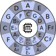

# Music Theory
In a bout of unexpected enthusiasum, I have recently taken a keen interest in music theory.
Most introductions to music theory talk about the basic concepts such as notes and scales.
Thereafter, they tell you to start memorising them.

That's not good enough for me.
I want to know why these things are as they are.
About three weeks ago, I began seriously researching the origins and mathematics of western music theory.
Half-way through writing a blog post on the fundamentals of western music's twelve note system, I started to find conflicting information.
Unsurprisingly, the history of music is a winding trail of mathematics, human preference and different cultures.

It's a topic that will require a lot more research before I can write about it.
I've ordered a copy of the book [Music: A Mathematical Offering](https://homepages.abdn.ac.uk/d.j.benson/pages/html/maths-music.html).
Although I've ordered a physical copy, the book is available for [free online](https://homepages.abdn.ac.uk/d.j.benson/pages/html/music.pdf).
It seems to be one of the most complete modern manuals bridging the gap between music, mathematics and culture.

Books like Music: A Mathematical Offering aren't very practical.
Fourier Transforms aren't going to directly help me to write a melody in C Major!
Therefore, in parallel with this kind of research, I have begun following the more traditional music theory path.
For the moment, I am happy to accept that I will occasionally have to memorise some things to progress.

# The Circle of 5ths
One of the most practical ways to apply music theory is to learn the Circle of 5ths.
If you are a musician, you have probably already heard about it.
That's because the Circle of 5ths tells us how the keys are related to each other, and the notes and chords in each key.

Here's a version of the Circle of 5ths showing all the major keys and their relative minors.

You may be more familiar with a version of this diagram where the minor keys are on the inner circle.
I've done it like this for a specific reason.
We'll get back to it at the end of the post.

For the rest of this post, I am going to build the circle step by step by walking around it in both directions.
To do this, you need to know about notes, intervals, keys and the major scale.
If any of those terms are not familiar to you, I recommend you look them up before reading the rest of this post.
David Bennet's [30 minute crash course](https://www.youtube.com/watch?v=xZgU57B3ZGg) is a great starting point.

When it comes to actually making music, what I am about to go through isn't very practical.
I like to understand how things work.
Ultimately, I think that having a deep understanding of a topic helps you to apply it well.

# Going Clockwise
The 5th is considered the most consonant interval.
So what happens if we start on a note, go up a 5th, and build another major scale?

As is common, let's take the note C as an example.
The notes in C Major are:
| Root  | Major 2nd  | Major 3rd  | Perfect 4th  | Perfect 5th  | Major 6th  | Major 7th  | Root  |
| :---: | :--------: | :--------: | :----------: | :----------: | :--------: | :--------: | :---: |
| C     | D          | E          | F            | G            | A          | B          | C     |

This follows the Major Scale Pattern

>Whole-Whole-Half-Whole-Whole-Whole-Half

For the rest of this post, I'm going to write this as W-W-H-W-W-W-H.
The note G is the 5th of C.
Using the notes from the C Major scale, let's count seven notes from G.

We get
|       |            |            |              |              |            |            |       |
| :---: | :--------: | :--------: | :----------: | :----------: | :--------: | :--------: | :---: |
| G     | A          | B          | C            | D            | E          | F          | G     |

Hold on.
Something's not quite right here.

The pattern of intervals is W-W-H-W-W-H-W.
This isn't a major scale!

We can make it a major scale by raising the 7th note a half step.
For this series of notes, that means the note F is raised to F#.

Now we have the G Major scale

| Root  | Major 2nd  | Major 3rd  | Perfect 4th  | Perfect 5th  | Major 6th  | Major 7th  | Root  |
| :---: | :--------: | :--------: | :----------: | :----------: | :--------: | :--------: | :---: |
| G     | A          | B          | C            | D            | E          | F#         | G     |

Let's check the pattern.
It's W-W-H-W-W-W-H.
That's a major scale!

Let's repeat this with the 5th of G.
Counting 5 scale notes from G, we get the note D.

Using the notes from G Major, count seven notes from D.
|       |            |            |              |              |            |            |       |
| :---: | :--------: | :--------: | :----------: | :----------: | :--------: | :--------: | :---: |
| D     | E          | F#         | G            | A            | B          | C          | D     |

Once again, this isn't quite a major scale.
The pattern is the same as before: W-W-H-W-W-H-W.
Once again, we can raise the 7th note to form a major scale.

We get the notes of D Major.
| Root  | Major 2nd  | Major 3rd  | Perfect 4th  | Perfect 5th  | Major 6th  | Major 7th  | Root  |
| :---: | :--------: | :--------: | :----------: | :----------: | :--------: | :--------: | :---: |
| D     | E          | F#         | G            | A            | B          | C#         | D     |

This pattern repeats itself indefinitely.
If we keep going, we eventually end up back at C Major!
This hints at why the 5th is 'perfect'.

If you really want to understand this, keep following the pattern until you get back to C Major.
It took me about thirty minutes to do this in a notebook.

Here is the result
| Root  | Major 2nd  | Major 3rd  | Perfect 4th  | Perfect 5th  | Major 6th  | Major 7th  | Root  |
| :---: | :--------: | :--------: | :----------: | :----------: | :--------: | :--------: | :---: |
| C     | D          | E          | F            | G            | A          | B          | C     |
| G     | A          | B          | C            | D            | E          | F#         | G     |
| D     | E          | F#         | G            | A            | B          | C#         | D     |
| A     | B          | C#         | D            | E            | F#         | G#         | A     |
| E     | F#         | G#         | A            | B            | C#         | D#         | E     |
| B     | C#         | D#         | E            | F#           | G#         | A#         | B     |
| F#    | G#         | A#         | B            | C#           | D#         | E#         | F#    |
| C#    | D#         | E#         | F#           | G#           | A#         | B#         | C#    |
| G#    | A#         | B#         | C#           | D#           | E#         | F##        | G#    |
| D#    | E#         | F##        | G#           | A#           | B#         | C##        | D#    |
| A#    | B#         | C##        | D#           | E#           | F##        | G##        | A#    |
| E#    | F##        | G##        | A#           | B#           | C##        | D##        | E#    |
| B#    | C##        | D##        | E#           | F##          | G##        | A##        | B#    |

Woah!
What's with all those double sharps!?
Look at each row of the table.
Each letter from the musical alphabet only appears once in the seven note scale.
While scales like D# Major are never written like this, you may see F# Major written with the E# notation.
That's because to write D# Major without repeating a letters, you need a lot of sharps!
You even need to introduce two double sharps.
That's ugly!
There's a better way to write D# Major.
We'll get to it later.

I've stopped at B# Major because it's just another way to write C Major.
We've gone all the way around the circle.
Outside of this extremely theoretical discussion, I wouldn't mention B# Major to any musicians!

By the time you've finished with this, you probably can't see the forest for the trees.
Let's step back and consider what we have done.

Starting on any note; the example used C; form a new major scale using the Perfect 5th of that note.
In other words, walk through the major scales ascending in 5ths.
The pattern turns out to be infinitely repeating.
What's more, even though they are notated weirdly, we pass by every major scale on the way!

# Have We Done It?
So is this it?
How does the results table compare to the Circle of 5ths?
Compare the 'Root' column of the to the Major Keys portion of the Circle of 5ths.

| Note    | 1  | 2   | 3   | 4   | 5   | 6    | 7     | 8     | 9   | 10  | 11  | 12  |
| :-----: | :-:| :-: | :-: | :-: | :-: | :--: | :---: | :---: | :-: | :-: | :-: | :-: |
| Root    | C  | G   | D   | A   | E   | B    | F#    | C#    | G#  | D#  | A#  | E#  |
| Circle  | C  | G   | D   | A   | E   | B/Cb | F#/Gb | Db/C# | Ab  | Eb  | Bb  | F   |

It's close, but it's not quite the same.
We seem have only got part of the right hand side of the circle correct.
What's going on?

# Enharmonics
An enharmonic note, key or scale, is the same note, key or scale but with a different name.
Look at the 9th column of the comparison table.
G# and Ab are the same note!
This applies similarly for the 10th and 11th columns.

Likewise, in the 5th column, Cb is the same note as B.

This is the Circle of 5ths!
There are only two things different about our constructed circle compared to the actual Circle of 5ths.

1. Some notes have a different name; notably the 9th, 10th, 11th and 12th notes.
2. The constructed circle does not show both names for enharmonic notes; notably for the 6th, 7th and 8th notes.

So how do we get to the actual circle?

# The Circle of 4ths
A consequence of the major scale pattern is that ascending in 5ths is the same as descending in 4ths.
Likewise, ascending in 4ths is the same as descending in 5ths.

To illustrate this, take the C Major scale and count up five notes from the root.

| Root  | Major 2nd  | Major 3rd  | Perfect 4th  | Perfect 5th  | Major 6th  | Major 7th  | Root  |
| :---: | :--------: | :--------: | :----------: | :----------: | :--------: | :--------: | :---: |
| C     | D          | E          | F            | G            | A          | B          | C     |

You get the note G.
Now start at the other end of the scale and count down 4 notes.
You also arrive at the note G!

To construct our circle, we went clockwise ascending in 5ths.
Therefore, going anti-clockwise would be descending in 5ths.
Descending in 5ths is the same as ascending in 4ths.

This means that, starting once again with C, we should be able to construct the circle by ascending in 4ths in the anti-clockwise direction.
Let's try it!

# Going Anti-Clockwise
Once again take the 5th of C Major, but this time count up only 4 notes to arrive at the note F.

The next seven notes are
|       |            |            |              |              |            |            |       |
| :---: | :--------: | :--------: | :----------: | :----------: | :--------: | :--------: | :---: |
| F     | G          | A          | B            | C            | D          | E          | F     |

Again, this is close to a major scale but is not quite the same.
The pattern is W-W-W-H-W-W-H.

To make it a major scale, the 4th note needs to be lowered one half step.
After doing that, we get the notes of F Major.

| Root  | Major 2nd  | Major 3rd  | Perfect 4th  | Perfect 5th  | Major 6th  | Major 7th  | Root  |
| :---: | :--------: | :--------: | :----------: | :----------: | :--------: | :--------: | :---: |
| F     | G          | A          | Bb           | C            | D          | E          | F     |

Let's check the interval pattern to be sure.
Yip, it's W-W-H-W-W-W-H.
It's a major scale!

Just like before, this pattern repeats itself around the circle.

Here is the result of going anti-clockwise around the circle in 4ths.
| Root  | Major 2nd  | Major 3rd  | Perfect 4th  | Perfect 5th  | Major 6th  | Major 7th  | Root  |
| :---: | :--------: | :--------: | :----------: | :----------: | :--------: | :--------: | :---: |
| C     | D          | E          | F            | G            | A          | B          | C     |
| F     | G          | A          | Bb           | C            | D          | E          | F     |
| Bb    | C          | D          | Eb           | F            | G          | A          | Bb    |
| Eb    | F          | G          | Ab           | Bb           | C          | D          | Eb    |
| Ab    | Bb         | C          | Db           | Eb           | F          | G          | Ab    |
| Db    | Eb         | F          | Gb           | Ab           | Bb         | C          | Db    |
| Gb    | Ab         | Bb         | Cb           | Db           | Eb         | F          | Gb    |
| Cb    | Db         | Eb         | Fb           | Gb           | Ab         | Bb         | Cb    |
| Fb    | Gb         | Ab         | Bbb          | Cb           | Db         | Eb         | Fb    |
| Bbb   | Cb         | Db         | Ebb          | Fb           | Gb         | Ab         | Bbb   |
| Ebb   | Fb         | Gb         | Abb          | Bbb          | Cb         | Db         | Ebb   |
| Abb   | Bbb        | Cb         | Dbb          | Ebb          | Fb         | Gb         | Abb   |
| Dbb   | Ebb        | Fb         | Gbb          | Abb          | Bbb        | Cb         | Dbb   |

We are back at C Major with Dbb Major.
Even more so than B# Major, I wouldn't recommend writing music in Dbb Major notation!

Now we have the same information but written with flats instead of sharps.
The Circle of 4ths and the Circle of 5ths is the same thing!

# Making Sense Of It All
Music theory and notation can be confusing.
That's because it's pretty difficult to write down sound.

We've written out all the major scales using flats, sharps, double flats and double sharps.
We could continue on this non-sensical notational journey but that wouldn't get us any further to the 'normal' Circle of 5ths.

Let's go clockwise around the circle, listing all the notes in both there sharp and flat variants.
|          |     |     |     |     |     |     |     |     |     |     |     |     |
| :------: | :-: | :-: | :-: | :-: | :-: | :-: | :-: | :-: | :-: | :-: | :-: | :-: |
| Sharps   | C   | G   | D   | A   | E   | B   | F#  | C#  | G#  | D#  | A#  | E#  |
| Flats    | Dbb | Abb | Ebb | Bbb | Fb  | Cb  | Gb  | Db  | Ab  | Eb  | Bb  | F   |

There are some obvious choices when picking which names to use.
The most obvious is to not use the the double flats.
That gives us the first quarter of the circle.

There is only one semitone between E and F, therefore Fb and E# are alos good candidates to eliminate.
There are cases where one might use E# or Fb.
For example, it makes sense to use E# in the F# Major scale.
Generally, however, the E# and Fb notation doesn't fit in.

We are left with the following scales.
|          |     |     |     |     |     |     |
| :------: | :-: | :-: | :-: | :-: | :-: | :-: |
| Sharps   | B   | F#  | C#  | G#  | D#  | A#  |
| Flats    | Cb  | Gb  | Db  | Ab  | Eb  | Bb  |

You'll notice that the enharmonic equivalents of Ab, Eb and Bb are not written on the circle.
To see why, look at the notes in the enharmonic equivalents of these scales.
| Root  | Major 2nd  | Major 3rd  | Perfect 4th  | Perfect 5th  | Major 6th  | Major 7th  | Root  |
| :---: | :--------: | :--------: | :----------: | :----------: | :--------: | :--------: | :---: |
| G#    | A#         | B#         | C#           | D#           | E#         | F##        | G#    |
| D#    | E#         | F##        | G#           | A#           | B#         | C##        | D#    |
| A#    | B#         | C##        | D#           | E#           | F##        | G##        | A#    |

We need double sharps to write them out like this!

For the B/Cb, F#/Gb and C#/Db scales, we can write both variants out without any double sharps or double flats.

For B/Cb
| Root  | Major 2nd  | Major 3rd  | Perfect 4th  | Perfect 5th  | Major 6th  | Major 7th  | Root  |
| :---: | :--------: | :--------: | :----------: | :----------: | :--------: | :--------: | :---: |
| B     | C#         | D#         | E            | F#           | G#         | A#         | B     |
| Cb    | Db         | Eb         | Fb           | Gb           | Ab         | Bb         | Cb    |

For F#/Gb
| Root  | Major 2nd  | Major 3rd  | Perfect 4th  | Perfect 5th  | Major 6th  | Major 7th  | Root  |
| :---: | :--------: | :--------: | :----------: | :----------: | :--------: | :--------: | :---: |
| F#    | G#         | A#         | B            | C#           | D#         | E#         | F#    |
| Gb    | Ab         | Bb         | Cb           | Db           | Eb         | F          | Gb    |

For C#/Db
| Root  | Major 2nd  | Major 3rd  | Perfect 4th  | Perfect 5th  | Major 6th  | Major 7th  | Root  |
| :---: | :--------: | :--------: | :----------: | :----------: | :--------: | :--------: | :---: |
| C#    | D#         | E#         | F#           | G#           | A#         | B#         | C#    |
| Db    | Eb         | F          | Gb           | Ab           | Bb         | C          | Db    |

This is why the enharmonic equivalents for B/Cb, F#/Gb and C#/Db are often shown on the circle.
They are the only major keys that can be written with both sharps and flats without using double sharps or double flats.

The key of F#/Gb is a turning point in the circle.
It is the only major key that has an equal number of sharps and flats.

When writing music, choosing to use the sharp or flat notation depends on the context of the music being written.

# Key Signatures
Key signatures come from the Circle of 5ths.

When ascending clockwise in 5ths, each step requires the 7th note to be made sharp.
The notes that must be sharpened at each step are added to the key signature in order.

A similar process is applied when ascending anti-clockwise in 4ths.

I'm not going to go into more detail than that.
This post is already very long and very confusing!

For now, it's enough to know that key signatures are derived from the idea of ascending in 4ths and 5ths.

# Modes
The Circle of 5ths shown at the beginning of this post has the major keys on the inside ring.
The outside ring shows the Relative Minor or Aeloin mode of each major key.

I've done it like this for a very specific reason.
Without going into too much detail about modes, writing the circle in this way makes it an extremely useful and practical tool for modulating between keys, switching modes, borrowing chords and knowing what chords belong to what key.

Mike George has an [excellent video](https://www.youtube.com/watch?v=BdgXQl1LDNw) covering this topic.

# A Bit of Fun
This is the kind of topic that makes your head sore!

To relax a little, listen to 'Norwegian Wood' by the Beatles.
It is one of my favourite songs.
Norwegian Wood is a great example of borrowing chords from different modes and switching to neighbouring modes.
Mike George's video from the previous section shows how it does this.

If you are more mathematically inclined, [this video](https://www.youtube.com/watch?v=V0YH8M6C-VM&pp=ygUXaW5rc2NhcGUgY2lyY2xlIG9mIDV0aHM%3D) is a fun little experiment.

I haven't discussed modes in detail here, but if after watching Mike George's video your interest is piqued, David Bennet has a whole [series of videos](https://www.youtube.com/watch?v=-CerXEcCJcY&list=PLlx2eo2tD6KoGvA_q0DFrYeLuwklZEy0O) explaining how modes are used in practice.
The one that got me to dig into these ideas is [this one](https://www.youtube.com/watch?v=roFVo0ePOZw&list=PLlx2eo2tD6KoGvA_q0DFrYeLuwklZEy0O&index=21).
