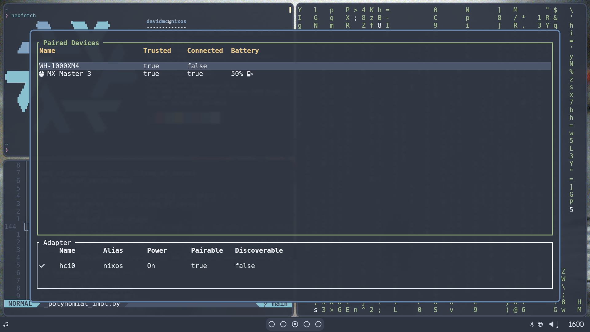

# Nix and NixOS
[Nix](https://nixos.org/) is a package manager born from a [2006 PhD](https://edolstra.github.io/pubs/phd-thesis.pdf) published by Eelco Dolstra.
To quote from the introduction section of paper:

> This thesis is about getting computer programs from one machine to another - and having them still work when they get there.

To achieve this, Dolstra developed Nix, a [purely functional programming language](https://en.wikipedia.org/wiki/Purely_functional_programming) in which software is defined declaratively in pure text.
Nix uses this declaration to create immutable packages stored in the [Nix Store](https://nix.dev/manual/nix/2.19/store/).
The declaration can be moved to another machine, and Nix can use it to populate that machine's store.
In theory, this guarantees that both machines have the same environment in which to run software.

Nix fetches packages from the [nixpkgs](https://github.com/NixOS/nixpkgs) repository.
A stable version of nixpkgs is released every six months.

NixOS is a Linux operating system which brings the declarative benefits of Nix to an operating system.

Nix and NixOS try to solve a problem that has been present since the beginning of computer software - reproducibility across different environments.
It's not all sunshine and roses in the Nix world though.
Like many of the technologies I find myself using, Nix has some frustrating drawbacks.

This post is about my experience using NixOS as an end user - that is, someone who wants to get things done rather than someone who is interested in an academically reproducible build environment.

# Docker/Podman
[Docker](https://www.docker.com/) and [Podman](https://podman.io/) are both tools that create containerised environments from a declarative instruction file.

So what's the difference?
Docker and Podman make use of a declarative build file to run imperative commands.
This means that Docker and Podman guarantee run-time reproducibility but not build-time reproducibility.
It's possible to write a Dockerfile that ensures build-time reproducibility, but Docker itself does not enforce it.

Nix is a declarative build tool.
By enforcing certain rules, Nix can theoretically guarantee both build and run-time reproducibility.

Docker and Podman are better suited to deploying software, while Nix is better at building it.

# Fedora - My Precursor to NixOS
My journey to NixOS started with [Fedora Sway Atomic](https://fedoraproject.org/atomic-desktops/sway/).
I found myself working with Docker more and more at work, and began to wonder if there are any operating systems that prioritise containerisation.
Sure enough, the Fedora project is doing just that with their set of atomic distributions.
The atomic distributions of Fedora use [rpm-ostree](https://github.com/coreos/rpm-ostree) and Podman to enforce immutability at the system level.

This sounded great, so I installed Fedora Sway Atomic on my home PC.
Unfortunately, using Podman to boot up quick development environments turns out to be completely impractical.
The major problem is that system level packages are completely separated from containers.
This is a pure but impractical setup.
My solution to this was to maintain a base Dockerfile with all the tools I use in the normal operation of my computer - things like Neovim, its plugin dependencies and common command line tools.
Then, whenever I needed to create a build environment, I would this image as the basis for the new environment.
I really didn't like this solution.
Not only was it high maintenance, but Docker's non-guarantee of build time reproducibility meant that my build environments weren't truly reproducible anyway.

Maybe I wasn't using Fedora Sway Atomic correctly, but it seems to me that the combination of rpm-ostree and Podman to manage containerised and immutable development is not the solution for a workstation PC.

I switched back to good old Ubuntu - until I stumbled across NixOS.

# I Use NixOS BTW
Of all the operating systems I've used, NixOS is my favourite.
It's probably a stretch to say that it will put an end to my distro hopping - but I suspect it will always be somewhere near the top of the list.

Today, I am running a fully customised desktop environment with NixOS as the centerpiece.
I started with a minimal install of NixOS, and have committed to the [Hypr](https://wiki.hyprland.org/Hypr-Ecosystem/) ecosystem combined with [Waybar](https://github.com/Alexays/Waybar) and Terminal User Interfaces (TUIs) to build what, for me, is the best desktop environment I have ever used for programming.
It does only what it needs to and is both version controllable and reproducible.
I've left some screenshots of what my day-to-day computing looks like at the end of this post.

# configuration.nix
With NixOS, the whole operating system is defined in a file called [configuration.nix](https://nixos.org/manual/nixos/stable/#sec-configuration-syntax).

Everything is defined in configuration.nix - from system hardware to users, system level packages, user packages, time zone, locale, audio, networking, fonts and environment variables - if it can be defined, it goes into configuration.nix.

This brings the reproducibility of the Nix package manager to operating systems - and it's fantastic!
It's incredible that it's possible to define a complex computer system in plain text.

Nix also provides a program called [Home Manager](https://github.com/nix-community/home-manager) which can be used to manage user level packages and dotfiles.
Personally, I don't use Home Manager because I think it's overkill for my single user use case.

NixOS really won me over when I got a new PC.
After a minimal install of NixOS, I simply created a Nix Shell (more on this in the next section), pulled my dotfiles in and ran `nixos-rebuild`.
Within an hour, I had exactly the same system as I had on my previous PC.
I know of no other tool that can do that so quickly and easily.

# Nix-Shell
From an end users perspective, my favourite part of Nix is the [Nix Shell](https://nix.dev/tutorials/first-steps/ad-hoc-shell-environments#ad-hoc-envs).
Nix Shell is how Nix provides both ad hoc and declarative build environments.

## Ad Hoc Shell
It's surprisingly common to need to use some software temporarily.
With imperative package managers, this would require you to install the software into the system - which could then potentially leave the system modified even after uninstalling the software.

With Nix Shell, it is easy to create an isolated shell environment using the [`-p`](https://nix.dev/tutorials/first-steps/ad-hoc-shell-environments#run-any-combination-of-programs) switch.
By default, the new shell is set up with the system's packages available in the shell's PATH, and with the system's environment variables set.

Because the shell inherits the system's packages and environment variables, the new shell behaves in the same way as your system shell - except that the packages you have specified are available too.

The Nix Shell defaults to bash, but because it inherits from the system, I can simply launch my preferred shell with the `--command` switch.
Here's an example of me trying out the [cowsay](https://en.wikipedia.org/wiki/Cowsay) program in a Nix Shell running [Nushell](https://www.nushell.sh/) and [Starship](https://starship.rs/):

I have starship set up to show the Nix logo when my prompt is running in a Nix Shell.

I use [grimblast](https://github.com/hyprwm/contrib/tree/main/grimblast) to take screenshots.
Grimblast is installed at the user level in my configuration.nix.
You can see that inside the Nix Shell Nushell and Starship behave the same as before, and grimblast is available in the shell's PATH.

If you want a completely isolated environment you can pass the `--pure` flag to the `nix-shell` command.
The new shell won't inherit any of the system packages or environment variables.
For extreme reproducibility, the nix-shell command has the [`-I nixos-config`](https://nix.dev/tutorials/first-steps/ad-hoc-shell-environments#towards-reproducibility) switch to pin the new shell to a specific revision of nxpkgs.

Nix installs packages in the Nix Store and leaves them there unless [`nix-collect-garbage`](https://nix.dev/manual/nix/2.28/command-ref/nix-collect-garbage.html) is run explicitly.
The Nix Store can quickly start to take up a lot of disk space.

# Declarative Shell
For a more declarative approach, Nix supports creating a Nix Shell from a [shell.nix](https://nix.dev/tutorials/first-steps/declarative-shell.html) file.
Inside shell.nix, the Nix language is used to describe the new shell.

Running `nix-shell` with a shell.nix file has all same functionality as the `-p` switch, except the newly created shell is defined entirely inside of shell.nix.
Environment variables can be defined in the shell by [adding them to shell.nix](https://nix.dev/tutorials/first-steps/declarative-shell.html#environment-variables).

This is the mechanism by which the Nix ecosystem allows one to create isolated and reproducible build environments.
The Nix system is designed for building software.
It therefore natural to use it to build a packages dependencies along with the package.
This is how many of the packages in nixpkgs are created.

# The Frustrating Parts of Using Nix and NixOS
The guarantee of reproducibility is Nix's greatest strength, but it's also its most frustrating feature.

## The Nix World is Isolated
Nix centers on creating immutable environments in the Nix Store.
Many standard and popular Linux tools assume the location of dependencies on the file system.
This isn't a problem for imperative Linux distributions because these libraries and their locations have been standardised for a long time.

Nix requires these libraries to be packaged as nixpkgs, because it's the only way Nix can guarantee reproducibility.
Therefore, these libraries are installed in the Nix Store, and cannot be found by tools assuming their standard location.

First, this creates an extra dependency on the maintainers of nixpkgs.
As an end-user, you have to wait for the bi-yearly releases of nixpkgs to get updates - and there's no guarantee that the package with the version you need will be included in the next release of nixpkgs.

It's completely possible to use Nix to pull in packages that are not part of nixpkgs.
However, not only is there no standard way of doing this, the common methods often undermine Nix's main selling point - reproducibility.

Second, it locks you into Nix.
Nix works, but often I would prefer to use a tool that is more standard.
A good example of this are Python virtual environments.
A lot of Python tools are written to integrate with Python virtual environments and don't play well with Nix.
It's a difficult ask to get everyone to learn Nix when tools like [uv](https://docs.astral.sh/uv/) and [Poetry](https://python-poetry.org/) are industry standard and work just as well in practice.

Nix is built around having an up to date central monorepo - nixpkgs.
If it's not in nixpkgs, it's difficult to get and manage.

## Flakes
[Flakes](https://nix.dev/concepts/flakes.html) are an experimental feature of Nix that aim to improve reproducibility and composability of Nix based projects.
Flakes introduce constraints that allow them to be more modular and to more easily pin specific versions of software.

Most Nix users recommend using Flakes, yet they have been marked as experimental since their introduction in 2021, and the same [arguments against them](https://nix.dev/concepts/flakes.html#why-are-flakes-controversial) then are still present today.

Flakes are a controversial topic in the Nix community, yet they are widely adopted.
The Nix developers have got themselves into a situation where they don't want to make major breaking changes, but many users feel they need to before finalising the feature.

Since the introduction of flakes, the Nix community has shifted focus away from the old way of doing things - yet they are unwilling to officially commit to the new way.
As an end-user, it's a huge downside that the Nix community can't make up their minds.
That's a harsh criticism, but I feel that it's valid from an end-user's point of view.
Ultimately, an end-user wants to get things done, not read for hours about whether one way of doing things is better than the other.

## Learning Curve
The Nix learning curve is one of the steepest I have ever encountered.
It doesn't help that a lot of Nix and NixOS is under-documented.
Generally I find that the documentation assumes you already understand whatever it is documenting.
[nix.dev](https://nix.dev/) is making an effort to improve this.

I probably find it more difficult than it is because I have never used a purely functional language before.
I'm learning two relatively complex things at one time.

# The Nix Life
Despite it's frustrating elements, NixOS is an excellent operating system.
It's as close as I've ever been to what I think is the ideal programming environment.

I love that my user packages are declared in a single file - and that I can add and remove them without fear of breakages.
I also love that I can make ad hoc shells to work with software that I know I'll only need once or twice.

It's great to be able to define reproducible environments all the required packages are in nixpkgs, but it is very frustrating when even one package isn't the right version - or not in nixpkgs at all.

Sometimes I get extremely frustrated with Nix and NixOS, but when I go back to what I was using before, I can't believe that I used to work like that.

# The Promised Pictures
Here are a couple of screenshots of my NixOS desktop environment.
The dotfiles for this are stored in a private GitHub repository.

## Window Manager and Status Bar (Hyprland and Waybar)

## Application Launcher (Rofi)

## Lock Screen (HyprLock)

## File Explorer (Yazi)

## Bluetooth Manager (Bluetui)

